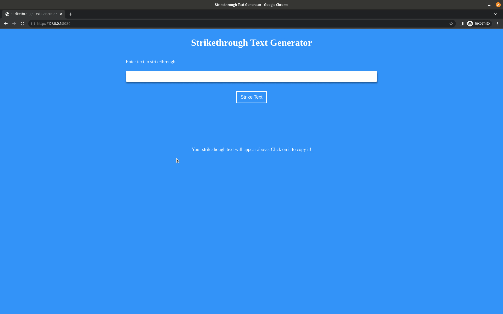

# Strikethrough Text Generator

This is a simple app that allows users to enter text, get a strikethrough version of the text, and copy it to their clipboard.

## Usage

Enter the text you want to have a strikethrough version of in the input box and click the "Strike Text" button to generate the strikethrough text. You can then click the strikethrough text to copy it to your clipboard.

## Contributing

Pull requests are welcome. For major changes, please open an issue first
to discuss what you would like to change.

Please make sure to update tests as appropriate.

## License

[MIT](https://choosealicense.com/licenses/mit/)
